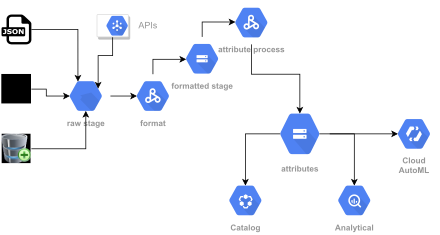

## Construção - Arquitetura Data Lake

> Com base em seu conhecimento e pesquisa, realize o desenho de uma arquitetura proposta para criação de um Data Lake. O desenho pode ser com tecnologias on-premises ou cloud Servers. Neste processo, sugira quais camadas no seu ponto de vista são necessárias para trafegar os dados e o disponibilizar para a empresa. Pense em camada(s) para o time de DataScience trabalhar.  
> Ao final, disponibilize o resultado do desenho e os detalhes com os pontos fortes e fracos da sua sugestão de arquitetura. Algumas dicas, mas que não seja um roteiro: pense em aquisição, tratamento, armazenamento e disponibilização dos dados.

### Desenho

Um breve disclaimer, idealizei a arquitetura na GCP, mas foi mais questão de desafio, sou mais habituado a AWS e até
on-premise do que GCP.

### Workflow
1. raw stage - Primeiro passo é criar um Cloud Storage para dados brutos
   * Aqui os dados são armazenados nos seus formatos de extração original
   * A organização é dividida por unidade de negócio, segmento, origem e medida temporal de aquisição
2. format - Criamos um Job Spark para formatar, particionar e satinizar os dados.
   * Aqui o objetivo é limpar os dados e organizar numa maneira otimizada para criar atributos
   * o legal de dividir dado bruto do formatado é a possibilidade de usar *cold storages* no dado bruto
3. formatted stage - Criamos um segundo lake para estruturar os dados
   * Podemos otimizar performance de acesso usando estruturas de armazenamento colunar
   * Podemos tratar a qualidade dos dados (satinização dados) adicionando regras até próximas de Feature Engineer
   * Ainda possuímos todos os eventos (sem agregações)
4. attribute process - Aqui criamos os books/feature-views, processando atributos customizados
   * Criar atribuitos baseado em agregações de eventos, *one hot encoder* e o que mais os
*Data Analytics/Science* possuirem de *insights*
5. attributes - Aqui armazenos atributos prontos para uso
   * Analytical - Usamos esse estagio para criação de modelos e para *Feature Engineer* dos attributes com o poderoso BigQuery
   * Catalog - Podemos fornecer nativamente um catalogo de atributos para fácil pesquisa dos *Data Sciences*
   * Cloud AutoML - Acredito que esse treino com dado tabular é complicado encaixar um *case* de treino não supervisionado, mas está ao alcance

### Pontos Fortes
* Alta disponibilidade
* Baixa manutenção
* Alta escalabilidade
* Muitas funcionalidades disponiveis logo de partida

### Pontos Fracos
* Vendor Lock-in
* Baixa customização
* Alto custo (esse pode ter mais de uma linha de pensamento)

